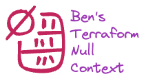

<br/>
<p align="center">
  <a href="https://github.com/bendoerr/terraform-null-context">
    <picture>
      <source media="(prefers-color-scheme: dark)" srcset="docs/logo-dark.png">
      
    </picture>
  </a>

<h3 align="center">Ben's Terraform Null Context Module</h3>

  <p align="center">
    This is how I do it.
    <br/>
    <br/>
    <a href="https://github.com/bendoerr/terraform-null-context"><strong>Explore the docs »</strong></a>
    <br/>
    <br/>
    <a href="https://github.com/bendoerr/terraform-null-context/issues">Report Bug</a>
    .
    <a href="https://github.com/bendoerr/terraform-null-context/issues">Request Feature</a>
  </p>
</p>

 

## About The Project

My opinionated context module that integrates with my other Terraform modules.

## Usage

```
module "context" {
  source    = "git@github.com:bendoerr/terraform-null-context?ref=v0.2.0"
  namespace = "brd"
  role      = "production'
  region    = "us-east-1"
}
```

### Requirements

| Name | Version |
|------|---------|
| <a name="requirement_terraform"></a> [terraform](#requirement\_terraform) | >= 0.13 |

### Providers

No providers.

### Modules

No modules.

### Resources

No resources.

### Inputs

| Name | Description | Type | Default | Required |
|------|-------------|------|---------|:--------:|
| <a name="input_attributes"></a> [attributes](#input\_attributes) | Additional id elements that would be appended. | `list(string)` | `[]` | no |
| <a name="input_context"></a> [context](#input\_context) | Allows the merging of an existing context with this one. | `any` | <pre>{<br>  "attributes": [],<br>  "dns_namespace": "",<br>  "environment": "",<br>  "instance": "",<br>  "instance_short": "",<br>  "namespace": "",<br>  "region": "",<br>  "region_short": "",<br>  "role": "",<br>  "role_short": "",<br>  "tags": {}<br>}</pre> | no |
| <a name="input_environment"></a> [environment](#input\_environment) | Element to identify the region and/or the role. If not provided this element<br>defaults to <role\_short>-<region\_short>(-<instance\_short>). | `string` | `""` | no |
| <a name="input_instance"></a> [instance](#input\_instance) | Element to identify a tenant or copy of an environment (blue-green<br>deployments). This is not used often. | `string` | `""` | no |
| <a name="input_instance_short"></a> [instance\_short](#input\_instance\_short) | Shortened version of the 'instance'.<br>Automatic shortening is done by removal of vowels. | `string` | `""` | no |
| <a name="input_namespace"></a> [namespace](#input\_namespace) | Element to ensure resources are generated with names that are globally<br>unique and do not collide. This should be a short key such as initials. | `string` | n/a | yes |
| <a name="input_region"></a> [region](#input\_region) | Key for the hosting provider region. | `string` | `""` | no |
| <a name="input_region_short"></a> [region\_short](#input\_region\_short) | Shortened version of the 'region'.<br>Automatic shortening is done by removal of vowels unless handled by special<br>cases such as 'us-east-1' => 'ue1', or 'us-west-2' => 'uw2'. | `string` | `""` | no |
| <a name="input_role"></a> [role](#input\_role) | A simple name for the hosting provider account or workspace. Included in<br>tags to ensure that identification is simple across accounts. Examples<br>'production', 'development', 'main'. | `string` | `""` | no |
| <a name="input_role_short"></a> [role\_short](#input\_role\_short) | Shortened version of the 'role'.<br>Automatic shortening is done by removal of vowels unless handled by special<br>cases such as 'production' => 'prod', or 'development' => 'dev'. | `string` | `""` | no |
| <a name="input_tags"></a> [tags](#input\_tags) | Additional tags to include. | `map(string)` | `{}` | no |

### Outputs

| Name | Description |
|------|-------------|
| <a name="output_attributes"></a> [attributes](#output\_attributes) | The evaluated attributes |
| <a name="output_dns_namespace"></a> [dns\_namespace](#output\_dns\_namespace) | A DNS namespace |
| <a name="output_environment"></a> [environment](#output\_environment) | The evaluated environment |
| <a name="output_instance"></a> [instance](#output\_instance) | The evaluated instance |
| <a name="output_instance_short"></a> [instance\_short](#output\_instance\_short) | The evaluated instance |
| <a name="output_namespace"></a> [namespace](#output\_namespace) | The evaluated namespace |
| <a name="output_region"></a> [region](#output\_region) | The evaluated region |
| <a name="output_region_short"></a> [region\_short](#output\_region\_short) | The evaluated region |
| <a name="output_role"></a> [role](#output\_role) | The evaluated role |
| <a name="output_role_short"></a> [role\_short](#output\_role\_short) | The evaluated role |
| <a name="output_shared"></a> [shared](#output\_shared) | Used for sharing the context with other modules |
| <a name="output_tags"></a> [tags](#output\_tags) | The evaluated tags |


## Roadmap

See the [open issues](https://github.com/bendoerr/terraform-null-context/issues) for a list of proposed features (and known issues).

## Contributing

Contributions are what make the open source community such an amazing place to be learn, inspire, and create. Any contributions you make are **greatly appreciated**.
* If you have suggestions for adding or removing projects, feel free to [open an issue](https://github.com/bendoerr/terraform-null-context/issues/new) to discuss it, or directly create a pull request after you edit the *README.md* file with necessary changes.
* Please make sure you check your spelling and grammar.
* Create individual PR for each suggestion.

### Creating A Pull Request

1. Fork the Project
2. Create your Feature Branch (`git checkout -b feature/AmazingFeature`)
3. Commit your Changes (`git commit -m 'Add some AmazingFeature'`)
4. Push to the Branch (`git push origin feature/AmazingFeature`)
5. Open a Pull Request

## License

Distributed under the MIT License. See [LICENSE](https://github.com/bendoerr/terraform-null-context/blob/main/LICENSE.txt) for more information.

## Authors

* **Benjamin R. Doerr** - *Terraformer* - [Benjamin R. Doerr](https://github.com/bendoerr/) - *Built Ben's Terraform Modules*

## Acknowledgements

* [ShaanCoding (ReadME Generator)](https://github.com/ShaanCoding/ReadME-Generator)
* [CloudPossie (Terraform Null Label - Inspiration)](https://github.com/cloudposse/terraform-null-label)
