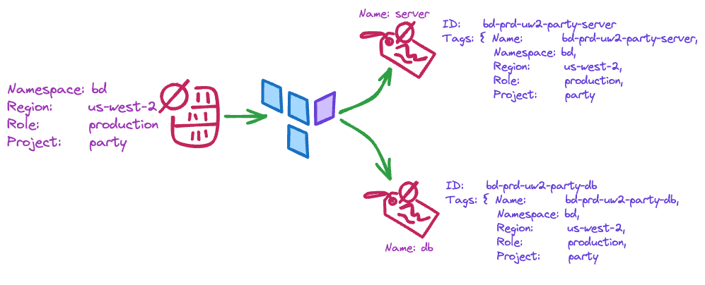

<br/>
<p align="center">
  <a href="https://github.com/bendoerr-terraform-modules/terraform-null-context">
    <picture>
      <source media="(prefers-color-scheme: dark)" srcset="https://github.com/bendoerr-terraform-modules/terraform-null-context/raw/main/docs/logo-dark.png">
      
    </picture>
  </a>

<h3 align="center">Ben's Terraform Null Context Module</h3>

  <p align="center">
    This is how I do it.
    <br/>
    <br/>
    <a href="https://github.com/bendoerr-terraform-modules/terraform-null-context"><strong>Explore the docs »</strong></a>
    <br/>
    <br/>
    <a href="https://github.com/bendoerr-terraform-modules/terraform-null-context/issues">Report Bug</a>
    .
    <a href="https://github.com/bendoerr-terraform-modules/terraform-null-context/issues">Request Feature</a>
  </p>
</p>

[](https://github.com/bendoerr-terraform-modules/terraform-null-context/graphs/contributors)
[](https://github.com/bendoerr-terraform-modules/terraform-null-context/issues)
[](https://github.com/bendoerr-terraform-modules/terraform-null-context/pulls)
[](https://github.com/bendoerr-terraform-modules/terraform-null-context/actions/workflows/test.yml)
[](https://github.com/bendoerr-terraform-modules/terraform-null-context/actions/workflows/lint.yml)
[](https://registry.terraform.io/modules/bendoerr-terraform-modules/context/null/latest)
[](https://securityscorecards.dev/viewer/?uri=github.com/bendoerr-terraform-modules/terraform-null-context)
[](https://github.com/bendoerr-terraform-modules/terraform-null-context/blob/main/LICENSE.txt)

## About The Project

My opinionated context module that integrates with my other Terraform modules.

<picture>

[//]: # (  <source media="&#40;prefers-color-scheme: dark&#41;" srcset="https://github.com/bendoerr-terraform-modules/terraform-null-context/raw/main/docs/usage-dark.png">)
  <source media="(prefers-color-scheme: dark)" srcset="docs/usage-dark.png">
  

[//]: # (  )
</picture>

This Terraform module simplifies the process of passing common values, such as 
project names and namespaces, to ensure consistent naming and tagging across 
various Terraform modules. The module normalizes and carries these values in a 
compact, ready-to-use format. It's designed to be consumed in conjunction with 
the `terraform-null-label` module. The context generated by 
`terraform-null-context` is utilized by `terraform-null-label` to produce 
consistent names and tags for different components.

## Usage

```
module "context" {
  source  = "bendoerr-terraform-modules/context/null"
  # Recommended to pin to a specific version
  version = "xxx"
  
  namespace = "brd"
  role      = "production'
  region    = "us-east-1"
}
```

### Requirements

| Name                                                                     | Version |
| ------------------------------------------------------------------------ | ------- |
| <a name="requirement_terraform"></a> [terraform](#requirement_terraform) | >= 0.13 |

### Providers

No providers.

### Modules

No modules.

### Resources

No resources.

### Inputs

| Name                                                                        | Description                                                                                                                                                                                | Type           | Default                                                                                                                                                                                                                                                   | Required |
| --------------------------------------------------------------------------- | ------------------------------------------------------------------------------------------------------------------------------------------------------------------------------------------ | -------------- | --------------------------------------------------------------------------------------------------------------------------------------------------------------------------------------------------------------------------------------------------------- | :------: |
| <a name="input_attributes"></a> [attributes](#input_attributes)             | Additional id elements that would be appended.                                                                                                                                             | `list(string)` | `[]`                                                                                                                                                                                                                                                      |    no    |
| <a name="input_context"></a> [context](#input_context)                      | Allows the merging of an existing context with this one.                                                                                                                                   | `any`          | <pre>{<br> "attributes": [],<br> "dns_namespace": "",<br> "environment": "",<br> "instance": "",<br> "instance_short": "",<br> "namespace": "",<br> "region": "",<br> "region_short": "",<br> "role": "",<br> "role_short": "",<br> "tags": {}<br>}</pre> |    no    |
| <a name="input_environment"></a> [environment](#input_environment)          | Element to identify the region and/or the role. If not provided this element<br>defaults to <role_short>-<region_short>(-<instance_short>).                                                | `string`       | `""`                                                                                                                                                                                                                                                      |    no    |
| <a name="input_instance"></a> [instance](#input_instance)                   | Element to identify a tenant or copy of an environment (blue-green<br>deployments). This is not used often.                                                                                | `string`       | `""`                                                                                                                                                                                                                                                      |    no    |
| <a name="input_instance_short"></a> [instance_short](#input_instance_short) | Shortened version of the 'instance'.<br>Automatic shortening is done by removal of vowels.                                                                                                 | `string`       | `""`                                                                                                                                                                                                                                                      |    no    |
| <a name="input_namespace"></a> [namespace](#input_namespace)                | Element to ensure resources are generated with names that are globally<br>unique and do not collide. This should be a short key such as initials.                                          | `string`       | n/a                                                                                                                                                                                                                                                       |   yes    |
| <a name="input_region"></a> [region](#input_region)                         | Key for the hosting provider region.                                                                                                                                                       | `string`       | `""`                                                                                                                                                                                                                                                      |    no    |
| <a name="input_region_short"></a> [region_short](#input_region_short)       | Shortened version of the 'region'.<br>Automatic shortening is done by removal of vowels unless handled by special<br>cases such as 'us-east-1' => 'ue1', or 'us-west-2' => 'uw2'.          | `string`       | `""`                                                                                                                                                                                                                                                      |    no    |
| <a name="input_role"></a> [role](#input_role)                               | A simple name for the hosting provider account or workspace. Included in<br>tags to ensure that identification is simple across accounts. Examples<br>'production', 'development', 'main'. | `string`       | `""`                                                                                                                                                                                                                                                      |    no    |
| <a name="input_role_short"></a> [role_short](#input_role_short)             | Shortened version of the 'role'.<br>Automatic shortening is done by removal of vowels unless handled by special<br>cases such as 'production' => 'prod', or 'development' => 'dev'.        | `string`       | `""`                                                                                                                                                                                                                                                      |    no    |
| <a name="input_tags"></a> [tags](#input_tags)                               | Additional tags to include.                                                                                                                                                                | `map(string)`  | `{}`                                                                                                                                                                                                                                                      |    no    |

### Outputs

| Name                                                                          | Description                                     |
| ----------------------------------------------------------------------------- | ----------------------------------------------- |
| <a name="output_attributes"></a> [attributes](#output_attributes)             | The evaluated attributes                        |
| <a name="output_dns_namespace"></a> [dns_namespace](#output_dns_namespace)    | A DNS namespace                                 |
| <a name="output_environment"></a> [environment](#output_environment)          | The evaluated environment                       |
| <a name="output_instance"></a> [instance](#output_instance)                   | The evaluated instance                          |
| <a name="output_instance_short"></a> [instance_short](#output_instance_short) | The evaluated instance                          |
| <a name="output_namespace"></a> [namespace](#output_namespace)                | The evaluated namespace                         |
| <a name="output_region"></a> [region](#output_region)                         | The evaluated region                            |
| <a name="output_region_short"></a> [region_short](#output_region_short)       | The evaluated region                            |
| <a name="output_role"></a> [role](#output_role)                               | The evaluated role                              |
| <a name="output_role_short"></a> [role_short](#output_role_short)             | The evaluated role                              |
| <a name="output_shared"></a> [shared](#output_shared)                         | Used for sharing the context with other modules |
| <a name="output_tags"></a> [tags](#output_tags)                               | The evaluated tags                              |

## Roadmap

See the
[open issues](https://github.com/bendoerr-terraform-modules/terraform-null-context/issues)
for a list of proposed features (and known issues).

## Contributing

Contributions are what make the open source community such an amazing place to
be learn, inspire, and create. Any contributions you make are **greatly
appreciated**.

- If you have suggestions for adding or removing projects, feel free to
  [open an issue](https://github.com/bendoerr-terraform-modules/terraform-null-context/issues/new)
  to discuss it, or directly create a pull request after you edit the
  _README.md_ file with necessary changes.
- Please make sure you check your spelling and grammar.
- Create individual PR for each suggestion.

### Creating A Pull Request

1. Fork the Project
2. Create your Feature Branch (`git checkout -b feature/AmazingFeature`)
3. Commit your Changes (`git commit -m 'Add some AmazingFeature'`)
4. Push to the Branch (`git push origin feature/AmazingFeature`)
5. Open a Pull Request

## License

Distributed under the MIT License. See
[LICENSE](https://github.com/bendoerr-terraform-modules/terraform-null-context/blob/main/LICENSE.txt)
for more information.

## Authors

- **Benjamin R. Doerr** - _Terraformer_ -
  [Benjamin R. Doerr](https://github.com/bendoerr/) - _Built Ben's Terraform
  Modules_

## Supported Versions

Only the latest tagged version is supported.

## Reporting a Vulnerability

See [README.md](README.md).

## Acknowledgements

- [ShaanCoding (ReadME Generator)](https://github.com/ShaanCoding/ReadME-Generator)
- [CloudPossie (Terraform Null Label - Inspiration)](https://github.com/cloudposse/terraform-null-label)
